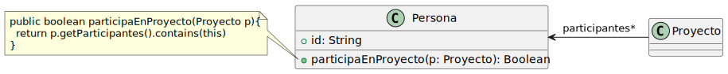
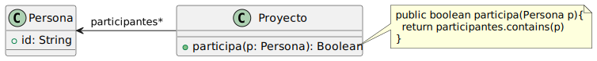

# Practica Refactoring

## Ejercicio 1: Algo huele mal
#### Indique que malos olores se presentan en los siguientes ejemplos

### 1.1 Protocolo Cliente
La clase cliente tiene el siguiente protocolo. ¿Como puedo mejorarlo?

```java
/**
* Retorna el límite de crédito del cliente
*/
protected double lmtCrdt() {...
/**
* Retorna el monto facturado al cliente desde la fecha f1 a la fecha f2
*/
protected double mtFcE(LocalDate f1, LocalDate f2) {...
/**
* Retorna el monto cobrado al cliente desde la fecha f1 a la fecha f2
*/
protected double mtCbE(LocalDate f1, LocalDate f2) {...
```

#### Resolucíon
- Cod Smells detetado:
    - Nombres de métodos más descriptivos:
    - Comentarios pocos informativos: si agregamos nombres más descriptivos, los comentarios actuales no serían necesarios.

    ```java
    public double getLimiteCredito() {...}

    public double getMontoFacturadoEntre(LocalDate f1, LocalDate f2) {...}

    public double getMontoCobradoEntre(LocalDate f1, LocalDate f2) {...}
    ```
### 1.2 Participación en Proyecto
Al revisar el siguiente diseño inicial (Figura 1), se decidió realizar un cambio para evitar lo que se consideraba un mal olor. El disño modificado se muestra en la Figura 2. Indique que tipo de cambio se realizó y si lo considere apropiado. Justifique su respuesta.


#### Diseño inicial:


#### Diseño revisado:


#### Resolución
1. Bad Smell detectado en el código:
    - Feature Envy

2. Extracto del código que presenta el mal olor:
    ```java 
    public boolean participaEnProyecto(Proyecto p){
        return p.getParticipantes().contains(this);
    }
    ```

3. Refactoring a aplicar que resuelve el Bad Smell:
    - Move Method

4. Código con el refactoring aplicado:
    ```java 
    public boolean participa(Proyecto p){
        return participantes.contains(p);
    }
    ```

### 1.3 Cálculos
Analice el código que se muestra a continucación. Indique qué _cod smells_ encuentra y cómo pueden corregirse.
```java
public void imprimirValores() {
    int totalEdades = 0;
    double promedioEdades = 0;  
    double totalSalarios = 0;
    for (Empleado empleado : personal) {
        totalEdades = totalEdades + empleado.getEdad();
        totalSalarios = totalSalarios + empleado.getSalario();
    }
    promedioEdades = totalEdades / personal.size();

    String message = String.format("El promedio de las edades es %s y el total de salarios es %s", promedioEdades, totalSalarios);

    System.out.println(message);
}
```
#### Resolución
- Bad Semlls:
    - Long Method
    - Reinventa la reuda(?
    - Temporary Field

- Comenzamos Long Method:
    - Refactoring a aplicar: _Extract Method_ y _Replace temp with query_
        ```java
        public void calcularPromedio(){
            int totalEdades = 0;
            double promedioEdades = 0;
            for (Empleado empleado : personal){
                totalEdades = totalEdades + empleado.getEdad();
            }
            promedioEdades = totalEdades / personal.size();
            return promedioEdades;
        }
        ```
- Seguimos con reinventa la rueda:
    - Refactoring a aplicar: _Replace loop with pipeline_
        ```java
        public double calcularPromedioEdades(){
            return personal.stream()
                    .mapToInt(p -> p.getEdad())
                    .average();
        }
        ```

- Algoritmo hasta el momento:
    ```java
    public void imprimirValores {
        double promedioEdades = this.calcularPromedioEdades();
        double totalSalarios = 0;

        for (Empleado empleado : personal){
            totalSalarios = totalSalarios + empleado.getSalario();
        }

        String message = String.format("El promedio de las edades es %s y el total de salarios es %s", promedioEdades, totalSalarios);

        System.out.println(message);
    }
    ```

- Como todavía el algoritmo no está totalmente refactorizado, seguimos. En este caso repetiríamo los pasos:
    - Long Method: aplicamos _Extract Method_ y _Replace temp with query_
        ```java
        public double salarioTotalEmpleados(){
            double totalSalario = 0;
            for (Empleado empleado: personal){
                totalSalario+= empleado.getSalario();
            }
            return totalSalario;
        }
        ```
- Reinventar la rueda
    - Refatoring: Replace Loop with Pipeline
        ```java
            public double salarioTotalEmpleados(){
                return personal.stream()
                        .mapToDouble(p -> p.getSalario())
                        .sum();
            }
        ```
- Algoritmo hasta el momento:
    ```java
    public void imprimirValores {
        double promedioEdades = this.calcularPromedioEdades();
        double totalSalarios = this.salarioTotalEmpleados();

        String message = String.format("El promedio de las edades es %s y el total de salarios es %s", promedioEdades, totalSalarios);

        System.out.println(message);
    }
    ```

