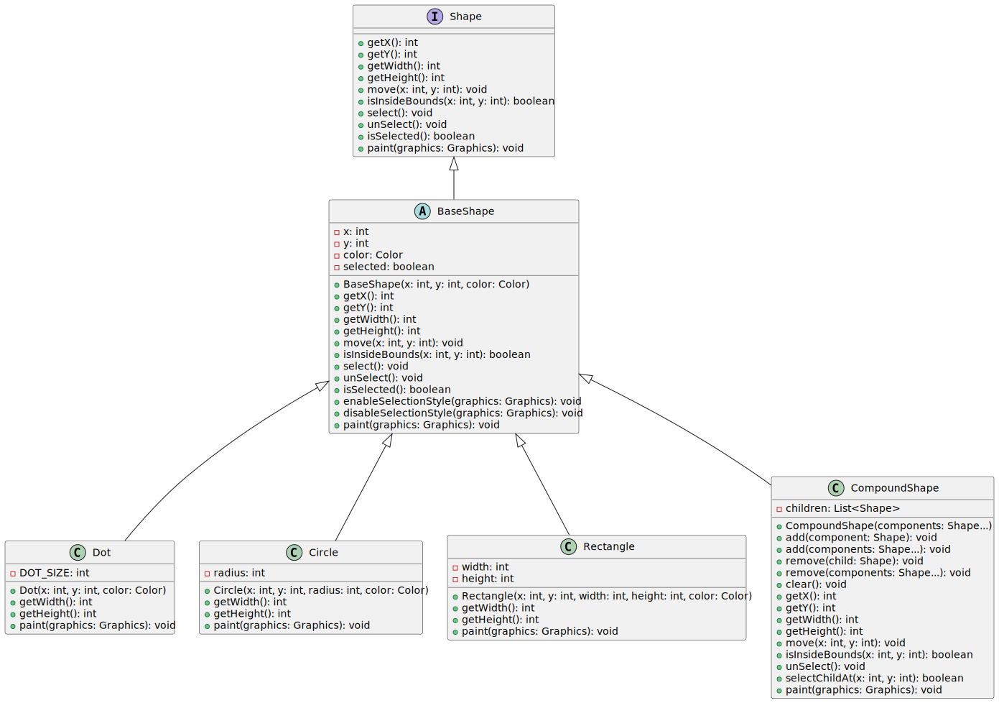

## Ejemplo Composite



1. _**Shape (Cliente)**_
    - Define las operaciones comunes que todas las formas deben implementar, como obtener coordenadas, moverse, verificar si un punto está dentro de la forma, seleccionar y deseleccionar, etc.
```java
public interface Shape {
    int getX();
    int getY();
    int getWidth();
    int getHeight();
    void move(int x, int y);
    boolean isInsideBounds(int x, int y);
    void select();
    void unSelect();
    boolean isSelected();
    void paint(Graphics graphics);
}
```

2. _**BaseShape (Component)**_
    - Implementa `Shape` proporcionando una base común para todas las formas.
    - Contiene la lógica común para mover, seleccionar, deseleccionar y pintar las formas.
    - También maneja estado de la selección de la forma.
```java
abstract class BaseShape implements Shape {
    public int x;
    public int y;
    public Color color;
    private boolean selected = false;
    BaseShape(int x, int y, Color color) {
        this.x = x;
        this.y = y;
        this.color = color;
    }
    @Override
    public int getX() {
        return x;
    }
    @Override
    public int getY() {
        return y;
    }
    @Override
    public int getWidth() {
        return 0;
    }
    @Override
    public int getHeight() {
        return 0;
    }
    @Override
    public void move(int x, int y) {
        this.x += x;
        this.y += y;
    }
    @Override
    public boolean isInsideBounds(int x, int y) {
        return x > getX() && x < (getX() + getWidth()) &&
                y > getY() && y < (getY() + getHeight());
    }
    @Override
    public void select() {
        selected = true;
    }
    @Override
    public void unSelect() {
        selected = false;
    }
    @Override
    public boolean isSelected() {
        return selected;
    }
    void enableSelectionStyle(Graphics graphics) {
        graphics.setColor(Color.LIGHT_GRAY);
        Graphics2D g2 = (Graphics2D) graphics;
        float[] dash1 = {2.0f};
        g2.setStroke(new BasicStroke(1.0f,
                BasicStroke.CAP_BUTT,
                BasicStroke.JOIN_MITER,
                2.0f, dash1, 0.0f));
    }
    void disableSelectionStyle(Graphics graphics) {
        graphics.setColor(color);
        Graphics2D g2 = (Graphics2D) graphics;
        g2.setStroke(new BasicStroke());
    }
    @Override
    public void paint(Graphics graphics) {
        if (isSelected()) {
            enableSelectionStyle(graphics);
        }
        else {
            disableSelectionStyle(graphics);
        }
    }
}
```

3. _**Dot, Circle, Rectangle (Leafs)**_
    - Implementan métodos específicos para obtener el ancho y alto de la forma y para pintar la forma

```java
public class Dot extends BaseShape {
    private final int DOT_SIZE = 3;
    public Dot(int x, int y, Color color) {
        super(x, y, color);
    }
    @Override
    public int getWidth() {
        return DOT_SIZE;
    }
    @Override
    public int getHeight() {
        return DOT_SIZE;
    }
    @Override
    public void paint(Graphics graphics) {
        super.paint(graphics);
        graphics.fillRect(x - 1, y - 1, getWidth(), getHeight());
    }
}
```

```java
public class Circle extends BaseShape {
    public int radius;
    public Circle(int x, int y, int radius, Color color) {
        super(x, y, color);
        this.radius = radius;
    }
    @Override
    public int getWidth() {
        return radius * 2;
    }
    @Override
    public int getHeight() {
        return radius * 2;
    }
    public void paint(Graphics graphics) {
        super.paint(graphics);
        graphics.drawOval(x, y, getWidth() - 1, getHeight() - 1);
    }
}
```

```java
public class Rectangle extends BaseShape {
    public int width;
    public int height;
    public Rectangle(int x, int y, int width, int height, Color color) {
        super(x, y, color);
        this.width = width;
        this.height = height;
    }
    @Override
    public int getWidth() {
        return width;
    }
    @Override
    public int getHeight() {
        return height;
    }
    @Override
    public void paint(Graphics graphics) {
        super.paint(graphics);
        graphics.drawRect(x, y, getWidth() - 1, getHeight() - 1);
    }
}
```

4. _**Compound Shape (Composite)**_
    - Representa una composición de formas, es decir, una forma que contiene otras formas.
    - Propaga operaciones a las formas contenidas (como mover, seleccionar, deseleccionar, pintar).
```java
public class CompoundShape extends BaseShape {
    protected List<Shape> children = new ArrayList<>();

    public CompoundShape(Shape... components) {
        super(0, 0, Color.BLACK);
        add(components);
    }

    public void add(Shape component) {
        children.add(component);
    }

    public void add(Shape... components) {
        children.addAll(Arrays.asList(components));
    }

    public void remove(Shape child) {
        children.remove(child);
    }

    public void remove(Shape... components) {
        children.removeAll(Arrays.asList(components));
    }

    public void clear() {
        children.clear();
    }

    @Override
    public int getX() {
        if (children.size() == 0) {
            return 0;
        }
        int x = children.get(0).getX();
        for (Shape child : children) {
            if (child.getX() < x) {
                x = child.getX();
            }
        }
        return x;
    }

    @Override
    public int getY() {
        if (children.size() == 0) {
            return 0;
        }
        int y = children.get(0).getY();
        for (Shape child : children) {
            if (child.getY() < y) {
                y = child.getY();
            }
        }
        return y;
    }

    @Override
    public int getWidth() {
        int maxWidth = 0;
        int x = getX();
        for (Shape child : children) {
            int childsRelativeX = child.getX() - x;
            int childWidth = childsRelativeX + child.getWidth();
            if (childWidth > maxWidth) {
                maxWidth = childWidth;
            }
        }
        return maxWidth;
    }

    @Override
    public int getHeight() {
        int maxHeight = 0;
        int y = getY();
        for (Shape child : children) {
            int childsRelativeY = child.getY() - y;
            int childHeight = childsRelativeY + child.getHeight();
            if (childHeight > maxHeight) {
                maxHeight = childHeight;
            }
        }
        return maxHeight;
    }

    @Override
    public void move(int x, int y) {
        for (Shape child : children) {
            child.move(x, y);
        }
    }

    @Override
    public boolean isInsideBounds(int x, int y) {
        for (Shape child : children) {
            if (child.isInsideBounds(x, y)) {
                return true;
            }
        }
        return false;
    }

    @Override
    public void unSelect() {
        super.unSelect();
        for (Shape child : children) {
            child.unSelect();
        }
    }

    public boolean selectChildAt(int x, int y) {
        for (Shape child : children) {
            if (child.isInsideBounds(x, y)) {
                child.select();
                return true;
            }
        }
        return false;
    }

    @Override
    public void paint(Graphics graphics) {
        if (isSelected()) {
            enableSelectionStyle(graphics);
            graphics.drawRect(getX() - 1, getY() - 1, getWidth() + 1, getHeight() + 1);
            disableSelectionStyle(graphics);
        }

        for (Shape child : children) {
            child.paint(graphics);
        }
    }
}
```