<h1 align="center">Teoría</h1>

## Adapter

Es una **patrón de diseño estructural** que permite la colaboración de objetos con interfaces incompatibles.

### Intención
- Adaptar la interface de una clase a la interface que espera el cliente (asumiendo que ambas interfaces son diferentes).
- Permitir que interfaces incompatibles trabajen juntas.

Cuando se habla de "interfaces", nos referimos a los elementos o firmas que una clase expone para que otras puedan utilizarla. No hace referencia a una clase `Interface`.

### Implementación
Para este patrón se necesitan ciertos prerequisitos:

1. Debe haber un `Cliente`, el cual delege la funcionalidad importarnte a un objeto diferente. El `Cliente` debe tener una referencia al objeto usando un tipo **abstracto** (una interface o clase abstracta). A esta interface o tipo abstracto se le da el nombre de `Target`.

2. Tener un objeto que implemente una funcionalidad, o tenga información, que pueda ser de interés para el `Cliente`, pero que no implemente la interface que se necesita. A este objeto se le da el nombre de `Adaptee`

### Motivación
Considere un ejemplo: un editor de dibujos que permite a los usuarios dibujar y organizar elementos gráficos (líneas, polígonos, texto, etc.) en imágenes y diagramas. La abstracción clave del editor de dibujos es el objeto gráfico, que tiene una forma editable y puede dibujarse a sí mismo. La interfaz para objetos gráficos está definida por una clase abstracta llamada `Shape`. El editor define una subclase de Shape para cada tipo de objeto gráfico: una clase `LineShape` para líneas, una clase `PolygonShape` para polígonos, etc.

Las clases para formas geométricas elementales como `LineShape` y `PolygonShape` son bastante fáciles de implementar, porque sus capacidades de dibujo y edición son inherentemente limitadas. Pero una subclase `TextShape` que pueda mostrar y editar texto es considerablemente más difícil de implementar, ya que incluso la edición de texto básica implica una actualización de pantalla y una complicada gestión del buffer. Mientras tanto, es posible que un kit de herramientas de interfaz de usuario disponible en el mercado ya proporcione una clase `TextView` sofisticada para mostrar y editar texto. Idealmente, nos gustaría reutilizar `TextView` para implementar `TextShape`, pero el kit de herramientas no se diseñó teniendo en cuenta las clases `Shape`. Por lo tanto, no podemos usar objetos `TextView` y `Shape` indistintamente.

¿Cómo pueden funcionar clases existentes y no relacionadas como TextView en una aplicación que espera clases con una interfaz diferente e incompatible? 

Podríamos cambiar la clase TextView para que se ajuste a la interfaz Shape, pero esa no es una opción a menos que tengamos el código fuente del kit de herramientas. Incluso si lo hiciéramos, no tendría sentido cambiar TextView; el kit de herramientas no debería tener que adoptar interfaces específicas de dominio sólo para que una aplicación funcione.
En su lugar, podríamos definir TextShape para que adapte la interfaz TextView a la de Shape. Podemos hacer esto de dos maneras: 
1. heredando la interfaz de Shape y la implementación de Text View o 
2. componiendo una instancia de TextView dentro de TextShape e implementando TextShape en términos de la interfaz de TextView. 

Estos dos enfoques corresponden a las versiones de clase y objeto del patrón Adaptador.
Llamamos a TextShape un adaptador.

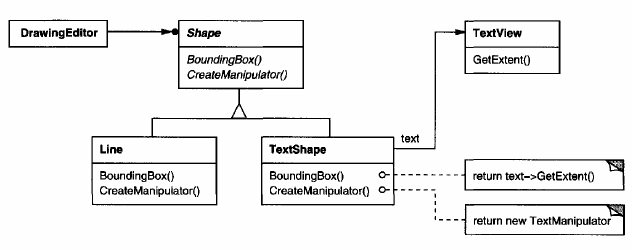

Este diagrama ilustra el caso del adaptador de objetos. Muestra cómo las solicitudes `BoundingBox`, declaradas en la clase `Shape`, se convierten en solicitudes `GetExtent` definidas en `TextView`. Dado que `TextShape` adapta `TextView` a la interfaz `Shape`, el editor de dibujo puede reutilizar la clase `TextView` que de otro modo sería incompatible.

A menudo, el adaptador es responsable de la funcionalidad que la clase adaptada no proporciona. El diagrama muestra cómo un adaptador puede cumplir dichas responsabilidades. El usuario debería poder "arrastrar" cada objeto `Shape` a una nueva ubicación de forma interactiva, pero `TextView` no está diseñada para hacer eso. `TextShape` puede agregar esta funcionalidad faltante implementando la operación `CreateManipulator` de `Shape`, que devuelve una instancia de la subclase `Manipulator` apropiada.

`Manipulator` es una clase abstracta para objetos que saben cómo animar una forma en respuesta a la entrada del usuario, como arrastrar la forma a una nueva ubicación. Hay subclases de `Manipulator` para diferentes formas; `TextManipulator`, por ejemplo, es la subclase correspondiente a `TextShape`. Al devolver una instancia de `TextManipulator`, `TextShape` agrega la funcionalidad de la que carece `TextView` pero que `Shape` requiere.

### Usabilidad
_Cuando se quiere usar una clase existente, y su interfaz no es compatible con la interfaz que nosotros precisamos._
- Si se tiene una clase que devuelve los datos en un formato específico, pero se requieren esos datos en un formato distinto, se puede usar "Adapter" para convertir los datos al formato requerido sin tener que modificar la clase original.

_Cuando se desea crear una clase reutilizable que coopere con clases no relacionadas._
  - Es decir que las clases no tienen necesariamente interfaces compatibles. Esto es útil cuando se require que varias clases trabajen juntas, pero no se pueden cambiar sus interfaces.

_En sistemas Legacy_
- Cuando queremos hacer uso de lo antigüo para que sea procesado por otro servicio.

_Cuando se necesiten reutilizar varias subclases existentes que no tengan funcionalidades comunes._

### Estructura
Es el único patrón que tiene los dos ámbitos, clases y objetosm ya que podemos implementarlos de dos formas diferentes.

- Un adaptador de clase usando herencia múltiple para adaptar una interfaz a otra.

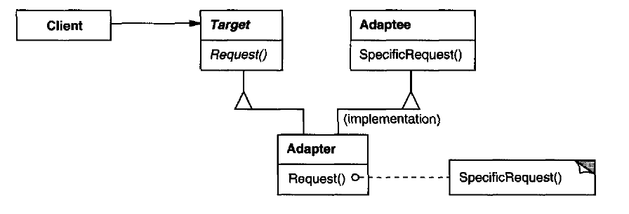

- Un adpatador de objetos basandose en la composición del objeto.

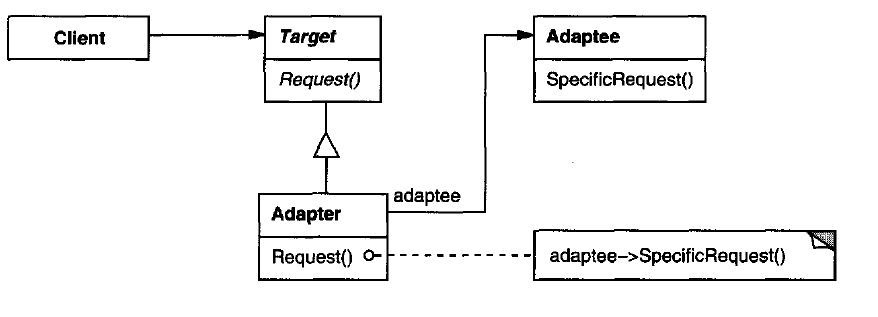

#### Roles fundamentales en la estructura del _Adapter_.
- **_Target_** (Shape): define la interfaz específica del dominio que utiliza el Cliente.

- **_Client_** (DrawingEditor): colabora con objetos que satisfacen la interfaz _Target_.

- **_Adaptee_** (TextView): define una interfaz que necesita ser adaptada.

- **_Adapter_** (TextShape): adapta la interfaz de _Adaptec_ a la interfaz de _Target_

## Template Method

Es un _patrón de diseño de comportamiento_ del ámbito de clases. Con este patrón se define **el esqueleto** de un algoritmo en una clase abstracta y se deja que sean las subclases quienes proporcionen **detalles concretos**  de algunos o todos los pasos de ese algoritmo. Lo interesante de este algoritmo es que también da la opción a las subclases de redefinir los pasos de acuerdo con sus necesidades, sin cambiar la estructura del algoritmo.

### Motivación 
Imagine que está creando una aplicación de minería de datos que analiza documentos corporativos. Los usuarios nutren la aplicación con documentos en varios formatos (PDF, DOC, CSV) e intenta extraer datos significativos de estos documentos en un formato uniforme.

La primera versión de la aplicación sólo podía funcionar con archivos DOC. En la siguiente versión, podía admitir archivos CSV. Un mes después, le "enseñó" a extraer datos de archivos PDF.

En algún momento, notaste que las tres clases tienen mucho código similar. Si bien el código para manejar varios formatos de datos era completamente diferente en todas las clases, el código para el procesamiento y análisis de datos es casi idéntico. ¿No sería mejor deshacerse de la duplicación de código y dejar intacta la estructura del algoritmo?

Hubo otro problema relacionado con el código del cliente que usaba estas clases. Tenía muchos condicionales que elegían un curso de acción adecuado según la clase del objeto de procesamiento. Si las tres clases de procesamiento tuvieran una interfaz común o una clase base, podría eliminar los condicionales en el código del cliente y usar polimorfismo al llamar a métodos en un objeto de procesamiento.

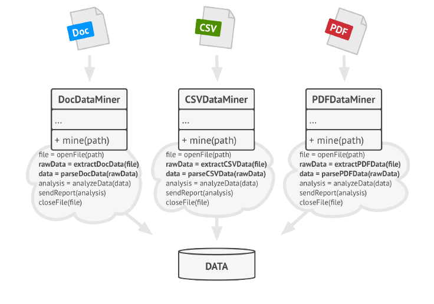

Template Method sugiere dividir el algoritmo en una serie de pasos, convertir estos pasos en métodos y colocar una serie de llamadas a estos métodos dentro de un único "template method". Los pasos pueden ser abstractos o tener alguna implementación predeterminada. Para usar el algoritmo, se supone que el cliente debe proporcionar su propia subclase, implementar todos los pasos abstractos y anular algunos de los opcionales si es necesario (pero no el template method en sí).

Veamos cómo se desarrollará esto en nuestra aplicación de minería de datos. Podemos crear una clase base para los tres algoritmos de análisis. Esta clase define un método de plantilla que consta de una serie de llamadas a varios pasos del procesamiento de documentos.

Al principio, podemos declarar todos los pasos abstractos, obligando a las subclases a proporcionar sus propias implementaciones para estos métodos. En nuestro caso, las subclases ya tienen todas las implementaciones necesarias, por lo que lo único que tendremos que hacer es ajustar las firmas de los métodos para que coincidan con los métodos de la superclase.

Ahora, veamos qué podemos hacer para deshacernos del código duplicado.
Parece que el código para abrir/cerrar archivos y extraer/analizar datos es diferente para distintos formatos de datos, por lo que no tiene sentido tocar esos métodos. Sin embargo, la implementación de otros pasos, como analizar los datos sin procesar y redactar informes, es muy similar, por lo que se puede incorporar a la clase base, donde las subclases pueden compartir ese código.

Tenemos dos tipos de pasos:

1. _Métodos Abstractos_, deben ser implementados por todas las subclases.
2. _Métodos Opcionales_, ya tienen cierta implementación por defecto, pero aún así pueden sobreescribirse si es necesairo.

Hay otro tipo de paso llamado **hooks**. Es un paso opcional con cuerpo vacío. El "template method" seguirá funcionando aunque el gancho no se sobreescriba. Normalmente los hooks se colocan antes y después de pasos cruciales de los algoritmos, suministrando a las subclases puntos adicionales de extensión para un algoritmo.

### Estructura
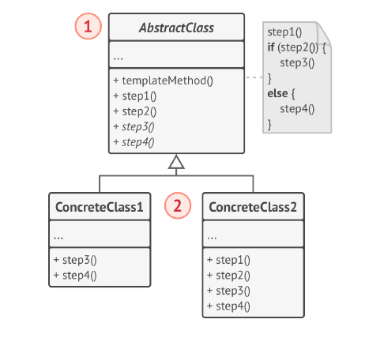

#### Roles
- **Clase Abstracta**
  - define _operaciones primitivas_ abstractas que son definidas en subclases concretas para implementar pasos de un algoritmo
  - implementa un "template method" que define el esqueleto de un algoritmo. El "template method" llama las operaciones primitivas como también a las operaciones definidas en la clase abstracta o la de los otros objetos.

- **Clase Concreta**: 
  - puede sobreescribir todos los pasos, pero no el propio "template method".

## Composite

Es un **patron de diseño estructural** que le permite _compooner objetos en estructura de árbol_ y luego trabajar con estas estructuras como si fueran objetos individuales.

El uso de Composite solo tiene sentido cuando el modelo central de la aplicación puede representarse en forma de árbol.

> El patrón Composite permite ejecutar un comportamiento de forma recursiva sobre todos los componentes de un árbol de objetos.

### Motivación
Imaginemos que tenemos dos tipos de objetos: _Productos_ y _Cajas_. Una _Caja_ puede contener varios _Productos_ así como cierto número de _Cajas_ más pequeñas. Estas _Cajas_ pequeñas también pueden contener algunos _Productos_ o incluso _Cajas_ más pequeñas, y así sucesivamente.

Suponiendo que se quiere crear un sistema de pedidos que utiliza estas clases. ¿Como se determinaría el precio total de ese pedido?

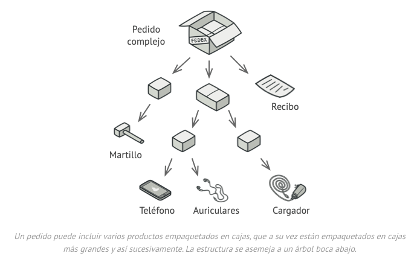

Una solución directa sería desenvolver todas las cajas, repasar todos los productos y calcular el total. Esto solo sería viable en el mundo real.

El patrón **Composite** siguiere trabajar con _Productos_ y _Cajas_ a través de una interfaz común que declara un método para calcular el precio total

#### Como funcionaría este método?
Para un producto solo devolveríamos el precio del producto. Para una caja, se recorre cada artículo que contiene la caja preguntando su precio y se devuelve el total por la caja. Si uno de estos artículos sería una caja más pequeña, esa caja también recorrería contenido y así **_recursivamente_**, hasta que se calcule el precio de todos los componentes internos. Una caja incluso podría añadir costos adicionales al precio final, como costos de empeaquetamiento.

La ventaja de esta solición es que no hay que preocuparse por las clases concretas de los objetos que componen el árbol. No hay necesidad de saber si un objeto es un producto simple o una sofisticada caja. Se tratan a todos por igual  través de una interfaz común.

Cuando se invoca a un método, los propios objetos pasan la solicitud a lo largo del árbol.

### Estructura

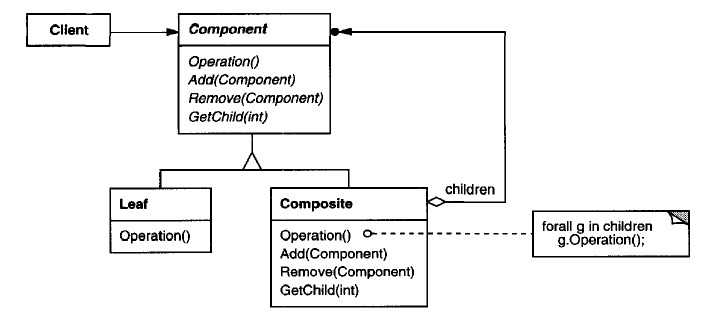

- El **Cliente** funciona con todos los elementos a través de la interfaz componente. Como resultado el cliente puede funcionar de la misma manera tanto con elementos simples o complejos del árbol.

- La interfaz **Componente** describe operaciones que son comunes a elementos simples y complejos del árbol.
  - (opcional) define una interfaz para acceder al "padre" de un componente en la estructura recursiva y la implementa si es apropiado.

- La **Hoja** es un elemento básico de un árbol que no tiene subelementos.
  - Normalmente, los componentes de la hoja acaban realizando la mayoría del trabajo real, ya que no tienen a nadie a quien delegarle el trabajo

- El **Contenedor** (también llamado compuesto) es un elemento que tiene subelementos: hojas u otros contenedores. Un contenedor no conoce las clases concretas de sus hijos. Funciona con todos los subelementos únicamente a través de la interfaz componente.
  - Al recibir una solicitud, un contenedor delega el trabajo a sus subelementos, procesa los resultados intermedios y devuelve el resultado final al cliente.

### Consecuencias
- Define jerarquías de clase consistentes de objetos primitivos y compuestos. Los objetos primitivos pueden componerse en objetos complejos, los que a su vez pueden componerse recursivamente
- Simplifica los objetos cliente. Los clientes usualmente no saben (y no deberían preocuparse) acerca de sis están manejando un compuesto o un simple.
- Hace más fácil el agreado de nuevos tipos de componentes porque los clientes no tienen que cambiar cuando aparecen nuevas clases componentes.
- No permite restringuir las estructuras de composición (cuando ciertos compuestos pueden armarse solo con cierto tipo de atómicos).

#### [Ejemplo](EjemploComposite.md#ejemplo-composite)

## Strategy

Es un _patrón de diseño de comportamiento con el ámbito de objeto_. Su finalidad es la de poder cambiar el algoritmo o comportamiento de un objeto en tiempo de ejecución. Con este patrón podemos aislar estos comportamientos o algoritmos en clases diferentes y elegir entre uno y otro en tiempo de ejecución.

La idea es que el código cliente se encargue de:
  1. Proveer la estrategia que desea utilizar.
  2. Utilizar la clase que hace de **puente** para que se realice la estrategia elegida.

### Motivación
Suponiendo una aplicación de procesamiento de pagos en línea. Originalmente, la aplicación solo acepta pagos con tarjeta de crédito. Sin embargo, debido a las demandas de los usuarios, se decide expandir las opciones de pago.

La primera actualización de la aplicación agrega la capacidad de pagar a través de PayPal. Esto se hace directamente en la clase principal de procesamiento de pagos, lo que resulta en una clase grande y difícil de mantener.

Luego, se reciben más solicitudes de los usuarios para agregar opciones de pago adicionales, como transferencia bancaria y pagos mediante cristomonedas.

La clase principal de procesamiento termina siendo demasiado grande, y cualquier cambio en un método de pago afecta a todo el sistema, lo que conlleva una alta probabilidad de introducir errores y dificultades para el mantenimiento.

### Solución
Para abordar este problema utilizando el patrón Strategy, separamos los diferentes métodos de pago en estrategias individuales.

Creamos una interfaz común llamada `PaymentStrategy` que define un método `processPayment()` que todas las estrategias de pago deben implementar.

Luego, creamos clases separadas para cada método de pago: `CreditCardPaymentStrategy`, `PayPalPaymentStrategy`, `BankTransferPaymentStrategy`, `CryptocurrencyPaymentStrategy`, etc. Cada una de estas clases implementa el método `processPayment()` de acuerdo con las necesidades específicas del método de pago correspondiente.

La clase principal de procesamiento de pagos ahora tiene un campo para almacenar una referencia a la estrategia de pago seleccionada. El cliente (la aplicación o el usuario) pasa la estrategia deseada al objeto de procesamiento de pagos.

El procesador de pagos delega el trabajo de procesamiento de pagos al objeto de estrategia seleccionado, en lugar de realizarlo directamente. Esto hace que la clase de procesamiento de pagos sea independiente de las implementaciones concretas de los métodos de pago.

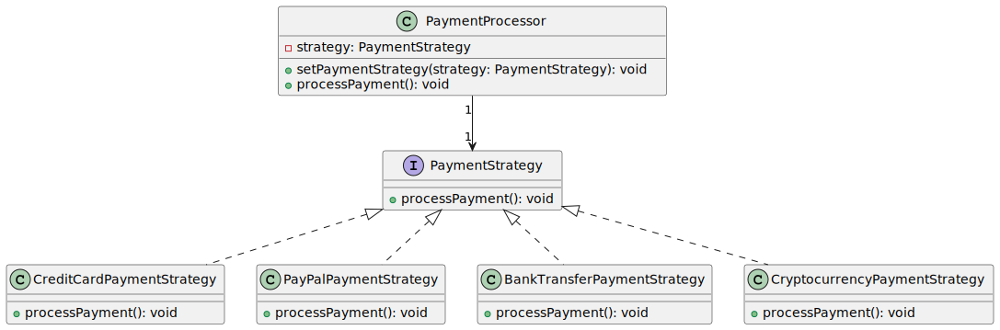

Como resultado, se pueden agregar nuevos métodos de pago o modificar los existentes sin tener que cambiar el código de la clase principal de procesamiento de pagos, lo que mejora la modularidad y la facilidad de mantenimiento de la aplicación.

### Estructura

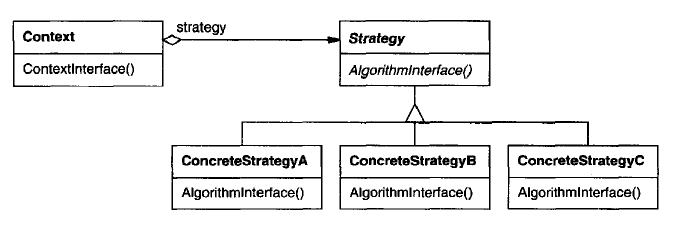

1. La clase **Context** mantiene una referencia a una de las estrategias concretas y se comunica con este objeto únicamnte a través de la interfaz _Strategy_.

2. La interfaz **Strategy** es común a todas las estrategias concretas. Declara un método que la clase _Context_ utiliza para ejecutar una estrategia.

3. Las **ConcreteStrategy** implementan distintas variaciones de un algoritmo que la clase contexto utiliza.

4. La clase _Context_ invoca el método de ejecución en el objeto estrategia viculado cada vez que necesita ejecutar el algoritmo. La clase _Context_ no sabe con que tipo de estrategia se va a encontrar o como se ejecutará el algoritmo.

5. El _Cliente_ crea un objeto estrategia específico y lo pasa a la clase _Context_. La clase _Context_ expone un modificador _set()_ que permite a los clientes sustituir la estrategia asociada al contexto durante el tiempo de ejecución.

### Aplicabilidad

- Cuando se quieran utilizar distintas variantes de un algoritmo dentro de un objeto y poder cambiar de un algoritmo a otro durante el tiempo de ejecución.

- Cuando haya muchas clases similares que sólo se diferencien en la forma en que ejecutan cierto comportamiento.

- Para aislar la lógica de negocio de una clase, de los detalles de implementación de algoritmos que pueden no ser tan importantes en el contexto de esa lógica.

- Cuando la clase tenga un enorme operador condicional que cambie entre distintas variantes del mismo algoritmo.

## State

Es un _patrón de diseño de comportamiento_ que permite a un objeto alterar su comportamiento cuando su estado interno cambia. 

Se caracteriza por modificar su comportamiento dependiendo del estado en el que se encuentra la aplicación. Para lograr esto es necesario crear una serie de clases que representarán los distintos estados por los que puede pasar la aplicación; es decir, se requiere de una clase por cada estado por el que la aplicación pueda pasar.

### Motivación
La idea principal del patrón de _state_ es **permitir que el objeto cambie su comportamiento sin cambiar su clase**. Además, al implementarlo, el código debería permanecer más limpio sin muchas declaraciones if/else.

Imginando que hay un paquete que se envía a una oficina de correos, y el paquete en sí se puede pedir, luego entregar a una oficina de correos y finalmente recibirlo un cliente. Ahora, dependiendo del estado real, queremos imprimir su estado de entrega.

El enfoque más simple sería agregar algunos indicadores booleanos y aplicar declaraciones simples if/else dentro de cada uno de nuestros métodos en la clase. Eso no sería muy complicado en un escenario simple. Sin embargo, podría complicar y contaminar el código cuando haya que procesar más estados, lo que resultará en aún más declaraciones if/else.

Además, toda la lógica para cada uno de los estados se distribuiría en todos los métodos. Ahora bien, aquí es donde se podría considerar el uso del patrón _State_. Gracias al patrón de diseño State, se peude encapsular la lógica en clases dedicadas, aplicar el principio de responsabilidad única y el principio abierto/cerrado, tener un código más limpio y fácil de mantener.

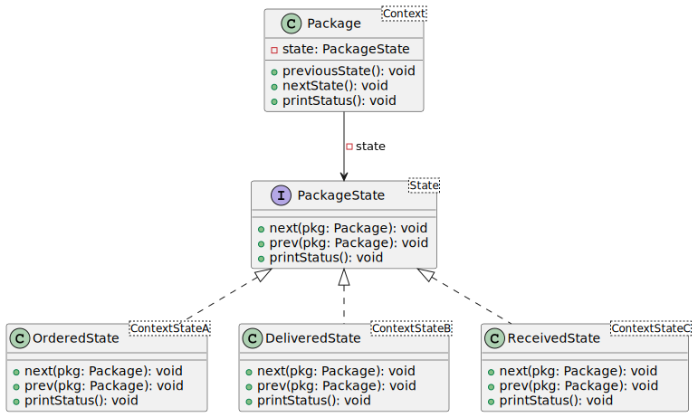

La clase `Package` actúa como un contexto. También mantiene una referencia a una instancia de una de las clases _State_ que representa el estado actual del Paquete.

El _Context_ delega la gestión de entradas del usuario a un objeto _State_. Naturalmente, el resultado depende del estado que se encuentre actualmente activo, ya que cada estado puede gestionar las entradas de manera diferente

La clase `PackageState` declara métodos que todos los estados concretos deben implementar, y también proporciona una referencia inversa al objeto contexto asociado con el estado. Los estados pueden utilizar la referencia inversa para dirigir el contexto a otro estado.

Los `ContextState` implementan varios comportamientos asociados a un estado contexto. También pueden disparar transiciones de estado en el contexto.

### Estructura 

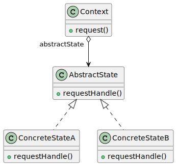

1. **Context** representa el componente que puede cambiar de estado,  el cual tiene entre sus atributos el estado actual. 

2. **AbstractState** es la clase base para la generación de los distintos estados. Se recomienda que sea una clase abstracta en lugar de una interface debido a que podemos definir comportamientos por default  y así afectar el comportamiento de todos los estados.  
Estos métodos deben tener sentido para todos los estados concretos para no tener estados que tengan métodos que nunca se usen.

3. **ConcreteState** representan a los componentes los cuales tienen un posible estado por el cual la aplicación puede pasar, por lo que tendremos un `ConcreteState` por cada estado posible, esta clase debe heredar de `AbstractState`.
    - Los objetos de estado pueden almacenar una referencia inversa al objeto de contexto. A través de esta referencia, el estado puede extraer cualquier información requerida del objeto contexto, así como inciari transiciones de estado.
    - Para evitar la duplicación de código similar a través de varios estados, _se pueden incluir clases abstractas intermedias_ que encapsulen algún comportamiento común

4. Tanto _Context_ como _ConcreteState_ pueden establecer el nuevo estado del contexto.
    - La responsabilidad de decidir cuando cambiar de estado está definida por los mismos estados.

### Como implementarlo
1. Decidir qué clase actuará como contexto. Puede ser una clase existente que ya tiene el código dependiente del estado, o una nueva clase, si el código específico del estado está distribuido a lo largo de varias clases.

2. Declarar la interfaz de estado. Aunque se puedan replicar todos los métodos declarados en el contexto, hay que centrarse en los que pueden contener comportamientos específicos del estado.

3. Para cada estado actual, crear una clase derivada de la interfaz de estado. Luego de verificar los métodos del contexto, extraer todo el código relacionado con ese estado para meterlo en la clase recién creada.  
Al mover el código a la clase estado, puede que haya problemas con los miembros privados del contexto. Aglunas soluciones alternativas:
    - Hacer publicos los campos o métodos (getters and setters).
    - Anidar las clases de estado en la clase contexto, sólo si el lenguaje de programación soporta clases anidadas.

4. En la clase contexto, añadir un campo de referencia del tipo de interfaz de estado y un modificador (setter) público que permita sobrescribir el valor de ese campo.

5. Repasar el método del contexto y sustituir los condicionales de estado vacíos por llamadas a métodos correspondientes del objeto de estado.

6. Para cambiar el estado del contexto, se crea una instancia de una de las clases de estado y se pasa a la clase contexto. Esto se puede hacer dentro de la propia clase contexto, en distintos estados, o en el cliente. Se haga de una forma u otra, la clase se vuelve dependiente de la clase de estado concreto que se instancia.

### Aplicabilidad
- Se recomienda utilizar este patrón cuando haya un objeto que se comporte de manera diferente dependiendo de su estado actual, el número de estados sea muy grande y el código específico del estado cambie con frecuencia
- Cuando haya una clase plagada con enormes condicionales que alteran el modo en que se comporta la clase de acuerdo con los valores actuales de los campos de la clase.
- O cuando haya mucho código duplicado por estados similares y transiciones de una máquina de estados basada en condiciones.

## Decorator
#### También conocido como Wrapper
Es un patrón estructural que permite añadir funcionalidades a objetos colocando estos objetos dentro de objetos encapsuladores especiales que contienen estas funcionalidades.

### f
Cuando se quiere alterar la funcionalidad de un objeto, lo primero que uno piensa es en extender una clase. Sin embargo, **la herencia tiene varias limitaciones** importantes.
- La herencia **es estática**. No se puede alterar la funcionalidad de un objeto existente el tiempo de ejecución. Solo se puede sustituir el objeto completo por otro creado a partir de una subclase diferente.
- Las **subclases solo pueden tener una clase padre**. En la mayoría de los lenguajes, la herencia no permite a una clase heredar comportamientos de varias clases al mismo tiempo.

Una de las formas de superar estas limitaciones es empleando la _**Agregación**_ o la _**Composición**_ en lugar de la _Herencia_. Ambas alternativas funcionan prácticamente del mismo modo: un objeto tiene una referencia a otro y le delega parte del trabajo, mientras  que con la herencia, el propio objeto puede realizar ese trabajo, heredando el comportamiento de su superclase.
  - En la **Agregación** el objeto X contiene objetos Y. Y puede existir sin X.
  - En la **Compoición** el objeto X está compuesto de objetos Y. X Administra el ciclo de vida de Y, además de que Y no puede existir sin X.

Con esta nueva solución se puede sustituir fácilmente el objeto "ayudante" vinculado por otro, cambiando el comportamiento del contenedor durante el tiempo de ejecución. Un objeto puede utilizar el comportamiento de varias clases con referencias a varios objetos, delegándole todo tipo de tareas. La agregación/composición es el principio clave que se esconde tras muchos patrones de diseño.

**“Wrapper”** (envoltorio) es el **sobrenombre alternativo del patrón Decorator**, que expresa claramente su idea principal. Un _wrapper_ es un objeto que puede vincularse con un objeto _objetivo_. El wrapper contiene el mismo grupo de métodos que el objetivo y le delega todas las solicitudes que recibe. No obstante, el wrapper puede alterar el resultado haciendo algo antes o después de pasar la solicitud al objetivo.

¿Cuándo se convierte un wrapper en decorator? El wrapper implementa la misma interfaz que el objeto envuelto. Éste es el motivo por el que, desde la perspectiva del cliente, estos objetos son idénticos. Haciendo que el campo de referencia del wrapper acepte cualquier objeto que siga esa interfaz, permitirá envolver un objeto en varios wrappers, añadiéndole el comportamiento combinado de todo lo demás.

### Estrucutra

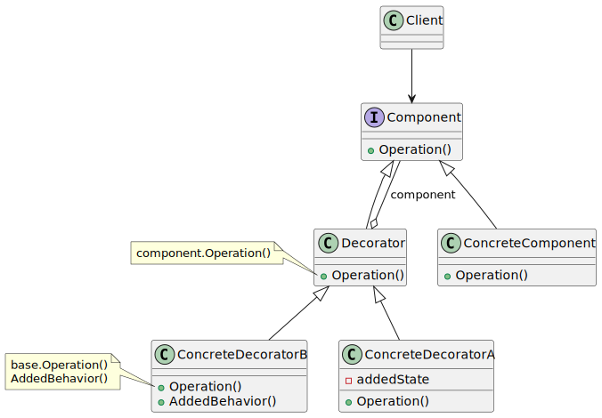

**Component:** es la interface (puede ser `Inteface` o `abstract Class`) que define la funcionalidad y de la cuál se hereda la clase concreta y los decoradores.

**ConcreteComponent:** es la implementación principal y cuya clase recibirá los decoradores para agregar funcionalidad extra dinámicamente.

**Decorador:** puede ser `abstract Class` o no que define el decorador que hereda de la interfaz `Component` y de la cual luego se crearán todos los demás decoradores. 
El decorador debe mantener la referencia al objeto original a fin de invocarlo y luego agregarle otras funcionalidades propias del decorador. Cada decorador tiene una relación con el componente de tipo has-a(tiene un).

**ConcreteDecorator:** son las clases que extienden o implementan el Decorator con la funcionalidad acotada.

### Implementación
1. Asegurarse de que el dominio de negocio puede representarse como un componente primario con varias capas opcionales encima.

2. Decidir qué métodos son comunes al componente primario y las capas opcionales. Crear una interfaz/clase asbrtacta de componente y declara esos métodos en ella.

3. Crear una clase concreta de componente y define en ella el comportamiento base.

4. Crear una clase base decoradora. Debe tener un campo para almacenar una referencia a un objeto wrapper. El campo debe declararse con el tipo de interfaz de componente para permitir la vinculación a componentes concretos, así como a decoradores. La clase decoradora base debe delegar todas las operaciones al objeto envuelto.

5. Asegurarse de que todas las clases implementan la interfaz de componente.

6. Crear decoradores concretos extendiéndolos a partir del decorador. Un decorador concreto debe ejecutar su comportamiento antes o después de la llamada al método padre (que siempre delega al objeto envuelto). 
El código cliente debe ser responsable de crear decoradores y componerlos del modo que el cliente necesite.

