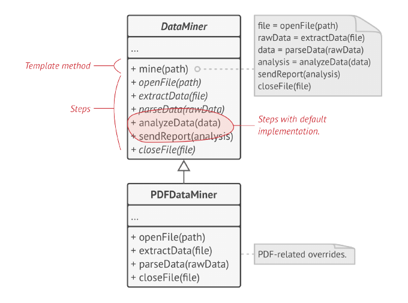

<h1 align="center">Teoría</h1>

<h2 align="center">Adapter</h2>

Es una **patrón de diseño estructural** que permite la colaboración de objetos con interfaces incompatibles.

### Intención
- Adaptar la interface de una clase a la interface que espera el cliente (asumiendo que ambas interfaces son diferentes).
- Permitir que interfaces incompatibles trabajen juntas.

Cuando se habla de "interfaces", nos referimos a los elementos o firmas que una clase expone para que otras puedan utilizarla. No hace referencia a una clase `Interface`.

### Implementación
Para este patrón se necesitan ciertos prerequisitos:

1. Debe haber un `Cliente`, el cual delege la funcionalidad importarnte a un objeto diferente. El `Cliente` debe tener una referencia al objeto usando un tipo **abstracto** (una interface o clase abstracta). A esta interface o tipo abstracto se le da el nombre de `Target`.

2. Tener un objeto que implemente una funcionalidad, o tenga información, que pueda ser de interés para el `Cliente`, pero que no implemente la interface que se necesita. A este objeto se le da el nombre de `Adaptee`

### Motivación
Considere un ejemplo: un editor de dibujos que permite a los usuarios dibujar y organizar elementos gráficos (líneas, polígonos, texto, etc.) en imágenes y diagramas. La abstracción clave del editor de dibujos es el objeto gráfico, que tiene una forma editable y puede dibujarse a sí mismo. La interfaz para objetos gráficos está definida por una clase abstracta llamada `Shape`. El editor define una subclase de Shape para cada tipo de objeto gráfico: una clase `LineShape` para líneas, una clase `PolygonShape` para polígonos, etc.

Las clases para formas geométricas elementales como `LineShape` y `PolygonShape` son bastante fáciles de implementar, porque sus capacidades de dibujo y edición son inherentemente limitadas. Pero una subclase `TextShape` que pueda mostrar y editar texto es considerablemente más difícil de implementar, ya que incluso la edición de texto básica implica una actualización de pantalla y una complicada gestión del buffer. Mientras tanto, es posible que un kit de herramientas de interfaz de usuario disponible en el mercado ya proporcione una clase `TextView` sofisticada para mostrar y editar texto. Idealmente, nos gustaría reutilizar `TextView` para implementar `TextShape`, pero el kit de herramientas no se diseñó teniendo en cuenta las clases `Shape`. Por lo tanto, no podemos usar objetos `TextView` y `Shape` indistintamente.

¿Cómo pueden funcionar clases existentes y no relacionadas como TextView en una aplicación que espera clases con una interfaz diferente e incompatible? 

Podríamos cambiar la clase TextView para que se ajuste a la interfaz Shape, pero esa no es una opción a menos que tengamos el código fuente del kit de herramientas. Incluso si lo hiciéramos, no tendría sentido cambiar TextView; el kit de herramientas no debería tener que adoptar interfaces específicas de dominio sólo para que una aplicación funcione.
En su lugar, podríamos definir TextShape para que adapte la interfaz TextView a la de Shape. Podemos hacer esto de dos maneras: 
1. heredando la interfaz de Shape y la implementación de Text View o 
2. componiendo una instancia de TextView dentro de TextShape e implementando TextShape en términos de la interfaz de TextView. 

Estos dos enfoques corresponden a las versiones de clase y objeto del patrón Adaptador.
Llamamos a TextShape un adaptador.

Este diagrama ilustra el caso del adaptador de objetos. Muestra cómo las solicitudes `BoundingBox`, declaradas en la clase `Shape`, se convierten en solicitudes `GetExtent` definidas en `TextView`. Dado que `TextShape` adapta `TextView` a la interfaz `Shape`, el editor de dibujo puede reutilizar la clase `TextView` que de otro modo sería incompatible.

A menudo, el adaptador es responsable de la funcionalidad que la clase adaptada no proporciona. El diagrama muestra cómo un adaptador puede cumplir dichas responsabilidades. El usuario debería poder "arrastrar" cada objeto `Shape` a una nueva ubicación de forma interactiva, pero `TextView` no está diseñada para hacer eso. `TextShape` puede agregar esta funcionalidad faltante implementando la operación `CreateManipulator` de `Shape`, que devuelve una instancia de la subclase `Manipulator` apropiada.

`Manipulator` es una clase abstracta para objetos que saben cómo animar una forma en respuesta a la entrada del usuario, como arrastrar la forma a una nueva ubicación. Hay subclases de `Manipulator` para diferentes formas; `TextManipulator`, por ejemplo, es la subclase correspondiente a `TextShape`. Al devolver una instancia de `TextManipulator`, `TextShape` agrega la funcionalidad de la que carece `TextView` pero que `Shape` requiere.

### Usabilidad
_Cuando se quiere usar una clase existente, y su interfaz no es compatible con la interfaz que nosotros precisamos._
- Si se tiene una clase que devuelve los datos en un formato específico, pero se requieren esos datos en un formato distinto, se puede usar "Adapter" para convertir los datos al formato requerido sin tener que modificar la clase original.

_Cuando se desea crear una clase reutilizable que coopere con clases no relacionadas._
  - Es decir que las clases no tienen necesariamente interfaces compatibles. Esto es útil cuando se require que varias clases trabajen juntas, pero no se pueden cambiar sus interfaces.

_En sistemas Legacy_
- Cuando queremos hacer uso de lo antigüo para que sea procesado por otro servicio.

_Cuando se necesiten reutilizar varias subclases existentes que no tengan funcionalidades comunes._

### Estructura
Es el único patrón que tiene los dos ámbitos, clases y objetosm ya que podemos implementarlos de dos formas diferentes.

- Un adaptador de clase usando herencia múltiple para adaptar una interfaz a otra.

- Un adpatador de objetos basandose en la composición del objeto.

#### Roles fundamentales en la estructura del _Adapter_.
- **_Target_** (Shape): define la interfaz específica del dominio que utiliza el Cliente.

- **_Client_** (DrawingEditor): colabora con objetos que satisfacen la interfaz _Target_.

- **_Adaptee_** (TextView): define una interfaz que necesita ser adaptada.

- **_Adapter_** (TextShape): adapta la interfaz de _Adaptec_ a la interfaz de _Target_

<h2 align="center">Template Method</h2>

Es un _patrón de diseño de comportamiento_ del ámbito de clases. Con este patrón se define **el esqueleto** de un algoritmo en una clase abstracta y se deja que sean las subclases quienes proporcionen **detalles concretos**  de algunos o todos los pasos de ese algoritmo. Lo interesante de este algoritmo es que también da la opción a las subclases de redefinir los pasos de acuerdo con sus necesidades, sin cambiar la estructura del algoritmo.

### Motivación 
Imagine que está creando una aplicación de minería de datos que analiza documentos corporativos. Los usuarios nutren la aplicación con documentos en varios formatos (PDF, DOC, CSV) e intenta extraer datos significativos de estos documentos en un formato uniforme.

La primera versión de la aplicación sólo podía funcionar con archivos DOC. En la siguiente versión, podía admitir archivos CSV. Un mes después, le "enseñó" a extraer datos de archivos PDF.

En algún momento, notaste que las tres clases tienen mucho código similar. Si bien el código para manejar varios formatos de datos era completamente diferente en todas las clases, el código para el procesamiento y análisis de datos es casi idéntico. ¿No sería mejor deshacerse de la duplicación de código y dejar intacta la estructura del algoritmo?

Hubo otro problema relacionado con el código del cliente que usaba estas clases. Tenía muchos condicionales que elegían un curso de acción adecuado según la clase del objeto de procesamiento. Si las tres clases de procesamiento tuvieran una interfaz común o una clase base, podría eliminar los condicionales en el código del cliente y usar polimorfismo al llamar a métodos en un objeto de procesamiento.

Template Method sugiere dividir el algoritmo en una serie de pasos, convertir estos pasos en métodos y colocar una serie de llamadas a estos métodos dentro de un único "template method". Los pasos pueden ser abstractos o tener alguna implementación predeterminada. Para usar el algoritmo, se supone que el cliente debe proporcionar su propia subclase, implementar todos los pasos abstractos y anular algunos de los opcionales si es necesario (pero no el template method en sí).

Veamos cómo se desarrollará esto en nuestra aplicación de minería de datos. Podemos crear una clase base para los tres algoritmos de análisis. Esta clase define un método de plantilla que consta de una serie de llamadas a varios pasos del procesamiento de documentos.

Al principio, podemos declarar todos los pasos abstractos, obligando a las subclases a proporcionar sus propias implementaciones para estos métodos. En nuestro caso, las subclases ya tienen todas las implementaciones necesarias, por lo que lo único que tendremos que hacer es ajustar las firmas de los métodos para que coincidan con los métodos de la superclase.

Ahora, veamos qué podemos hacer para deshacernos del código duplicado.
Parece que el código para abrir/cerrar archivos y extraer/analizar datos es diferente para distintos formatos de datos, por lo que no tiene sentido tocar esos métodos. Sin embargo, la implementación de otros pasos, como analizar los datos sin procesar y redactar informes, es muy similar, por lo que se puede incorporar a la clase base, donde las subclases pueden compartir ese código.

Tenemos dos tipos de pasos:

1. _Métodos Abstractos_, deben ser implementados por todas las subclases.
2. _Métodos Opcionales_, ya tienen cierta implementación por defecto, pero aún así pueden sobreescribirse si es necesairo.

Hay otro tipo de paso llamado **hooks**. Es un paso opcional con cuerpo vacío. El "template method" seguirá funcionando aunque el gancho no se sobreescriba. Normalmente los hooks se colocan antes y después de pasos cruciales de los algoritmos, suministrando a las subclases puntos adicionales de extensión para un algoritmo.

### Estructura

#### Roles
- **Clase Abstracta**
  - define _operaciones primitivas_ abstractas que son definidas en subclases concretas para implementar pasos de un algoritmo
  - implementa un "template method" que define el esqueleto de un algoritmo. El "template method" llama las operaciones primitivas como también a las operaciones definidas en la clase abstracta o la de los otros objetos.

- **Clase Concreta**: 
  - puede sobreescribir todos los pasos, pero no el propio "template method".

<h2 align="center"> Composite</h2>

Es un **patron de diseño estructural** que le permite _compooner objetos en estructura de árbol_ y luego trabajar con estas estructuras como si fueran objetos individuales.

El uso de Composite solo tiene sentido cuando el modelo central de la aplicación puede representarse en forma de árbol.

> El patrón Composite permite ejecutar un comportamiento de forma recursiva sobre todos los componentes de un árbol de objetos.

### Motivación
Imaginemos que tenemos dos tipos de objetos: _Productos_ y _Cajas_. Una _Caja_ puede contener varios _Productos_ así como cierto número de _Cajas_ más pequeñas. Estas _Cajas_ pequeñas también pueden contener algunos _Productos_ o incluso _Cajas_ más pequeñas, y así sucesivamente.

Suponiendo que se quiere crear un sistema de pedidos que utiliza estas clases. ¿Como se determinaría el precio total de ese pedido?

Una solución directa sería desenvolver todas las cajas, repasar todos los productos y calcular el total. Esto solo sería viable en el mundo real.

El patrón **Composite** siguiere trabajar con _Productos_ y _Cajas_ a través de una interfaz común que declara un método para calcular el precio total

#### Como funcionaría este método?
Para un producto solo devolveríamos el precio del producto. Para una caja, se recorre cada artículo que contiene la caja preguntando su precio y se devuelve el total por la caja. Si uno de estos artículos sería una caja más pequeña, esa caja también recorrería contenido y así **_recursivamente_**, hasta que se calcule el precio de todos los componentes internos. Una caja incluso podría añadir costos adicionales al precio final, como costos de empeaquetamiento.

La ventaja de esta solición es que no hay que preocuparse por las clases concretas de los objetos que componen el árbol. No hay necesidad de saber si un objeto es un producto simple o una sofisticada caja. Se tratan a todos por igual  través de una interfaz común.

Cuando se invoca a un método, los propios objetos pasan la solicitud a lo largo del árbol.

### Estructura

- El **Cliente** funciona con todos los elementos a través de la interfaz componente. Como resultado el cliente puede funcionar de la misma manera tanto con elementos simples o complejos del árbol.

- La interfaz **Componente** describe operaciones que son comunes a elementos simples y complejos del árbol.

- La **Hoja** es un elemento básico de un árbol que no tiene subelementos.
  - Normalmente, los componentes de la hoja acaban realizando la mayoría del trabajo real, ya que no tienen a nadie a quien delegarle el trabajo

- El **Contenedor** (también llamado compuesto) es un elemento que tiene subelementos: hojas u otros contenedores. Un contenedor no conoce las clases concretas de sus hijos. Funciona con todos los subelementos únicamente a través de la interfaz componente.
  - Al recibir una solicitud, un contenedor delega el trabajo a sus subelementos, procesa los resultados intermedios y devuelve el resultado final al cliente.